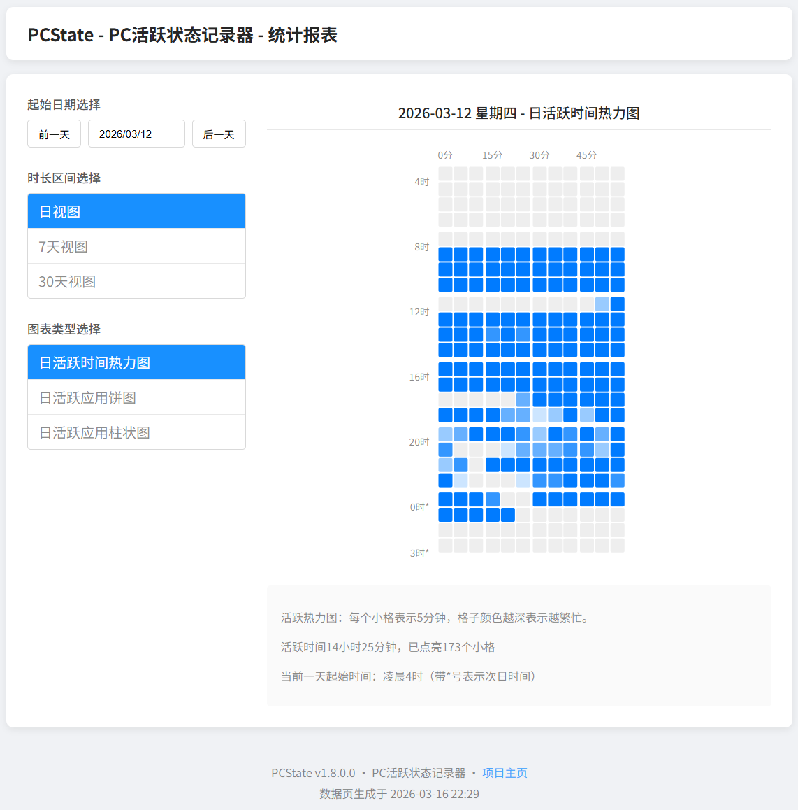

# PCState - PC活跃状态记录器

一个简单的小工具，挂在托盘里记录你每天用电脑的时间分布，以及使用不同应用程序的时长。

## 功能特点

- 轻量级：单文件exe，仅几MB，低内存占用
- 静默运行：无界面程序，托盘图标直观显示活跃/闲置状态
- 数据可视化：支持日/周/月三种视图，热力图/饼图/柱状图三种图表
- 隐私友好：所有数据仅记录在用户本机
- 数据导出：支持CSV格式导出
- 开机自启：可配置Windows开机启动



## 下载使用

从 [Releases](https://github.com/3plus10i/pcstate/releases) 下载。

> 运行过程中会产生数据文件 `pcstate.db` 和临时文件夹 `temp/`，为防止意外情况，建议将本程序放在一个专用的干净文件夹下运行。

程序会在托盘显示图标：
- 🟢 绿色 = 活跃（最近有键鼠操作）
- ⚪ 灰色 = 闲置

右键图标可以：
- 查看报表 - 打开网页查看最近30天的活跃情况
- 开机启动 - 设置是否随 Windows 启动
- 设置一天的开始时间 - 从0点或者4点开始计算
- 查看程序目录
- 导出CSV - 导出最近N天的数据

> 仅支持Windows。需要保持程序运行才能记录，建议开启开机启动功能。

## 本程序记录的用户行为
- 活跃/闲置状态（每分钟内是否存在键鼠操作）
- 活动程序进程名（如 `chrome`、`Code.exe`）
- 进程名为空时，记录窗口标题前16字符（常用于反作弊游戏等特殊场景）


## 打包

有 Python 环境的话也可以自己运行：

```bash
pip install -r requirements.txt
python main.py
```

或打包成 exe （基于 PyInstaller）：

```bash
python build.py --release
```

输出在 `release/` 目录。

---

## 技术文档

[技术文档](techdoc.md)

