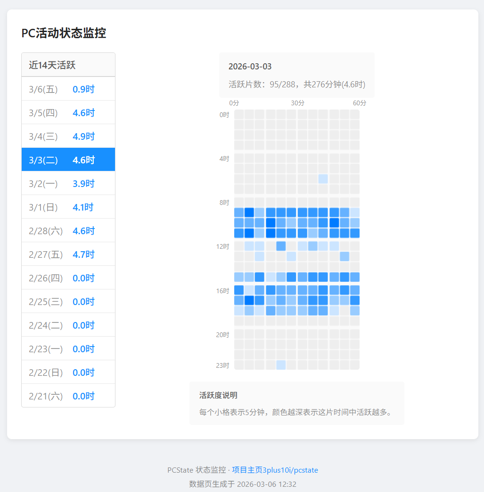

# PCState - PC活跃状态记录器

一个简单的小工具，挂在托盘里记录你每天用电脑的时间。



## 下载使用

从 [Releases](https://github.com/3plus10i/pcstate/releases) 下载。

> 运行过程中会产生数据文件 `pcstate.db` 和临时文件夹 `temp/`，为防止意外情况，建议将本程序放在一个专用的干净文件夹下运行。

程序会在托盘显示图标：
- 🟢 绿色 = 活跃（最近有键鼠操作）
- ⚪ 灰色 = 闲置

右键图标可以：
- 查看报表 - 打开网页查看最近14天的活跃情况
- 开机启动 - 设置是否随 Windows 启动
- 设置一天的开始时间 - 从0点或者4点开始计算
- 查看程序目录

> 仅支持Windows。需要保持程序运行才能记录，建议开启开机启动功能。

## 打包

有 Python 环境的话也可以自己运行：

```bash
pip install -r requirements.txt
python main.py
```

或打包成 exe （基于 PyInstaller）：

```bash
python build.py --release
```

输出在 `release/` 目录。

---

## 技术文档

[技术文档](techdoc.md)

